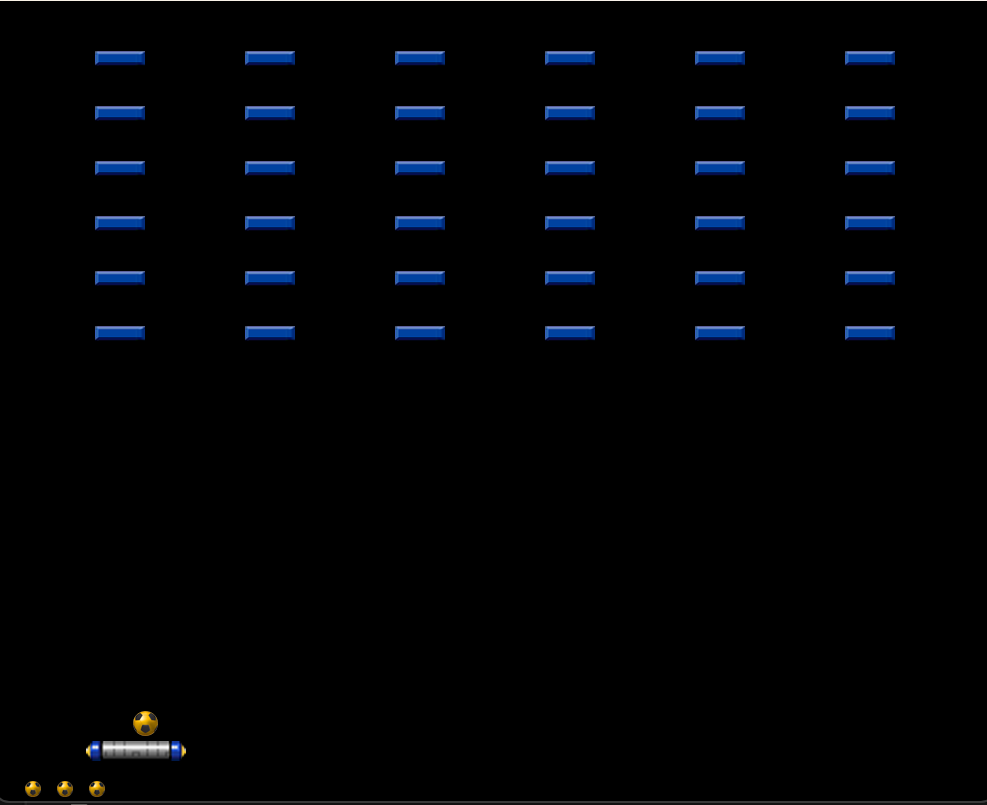

# Arcade
An arcade made with SFML library.

It has 3 levels of difficulty where you need to hit all the blocks to pass the level.
You only have 3 attempts to beat the level.

To play the game download and unzip **Game.zip** and start **Arcade.exe**

The Game currently builded only for Windows and require a mouse or touchpad.

